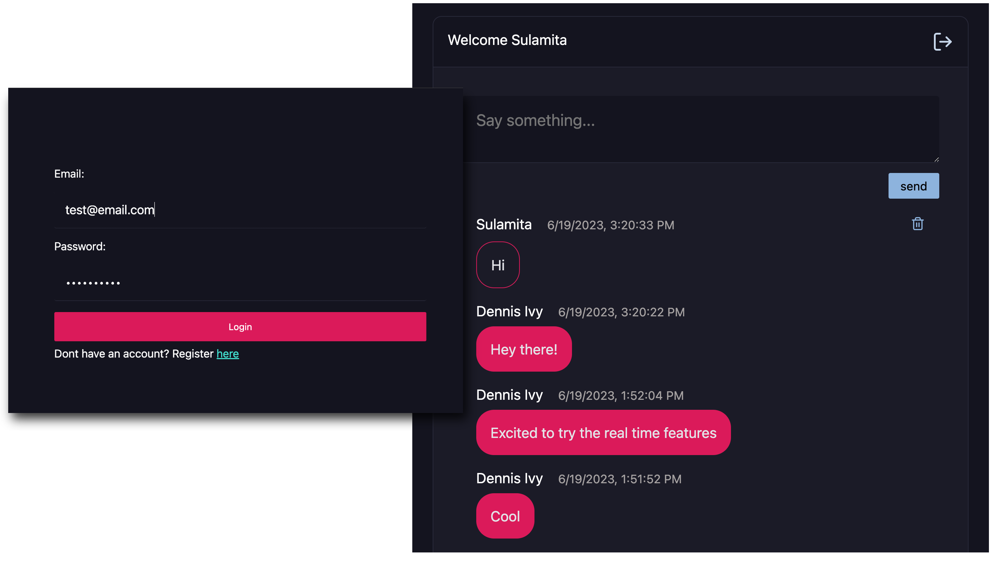

# Real Time Chat App With React JS and Appwrite

A chat app with real-time capabilities that utilizes Appwrite on the backend. 

> Tutorial Link Will be added here when posted.



### Getting Started

After cloning the repo ensure you complete the necessary installations

```
$ npm install
$ npm run dev
```

Create a new `.env` folder and create the necessary variables based on the `src/appwriteConfig.js` file. Appwrite setup will be covered in the next step.

```js
//appwrite.Config.js
...
export const API_ENDPOINT = import.meta.env.VITE_API_ENDPOINT
export const PROJECT_ID = import.meta.env.VITE_PROJECT_ID
export const DATABASE_ID = import.meta.env.VITE_DATABASE_ID
export const COLLECTION_ID_MESSAGES = import.meta.env.VITE_COLLECTION_ID_MESSAGES

const client = new Client()
    .setEndpoint(API_ENDPOINT) 
    .setProject(PROJECT_ID);              
...
```

**Setting Up Appwrite Account**

Set up a local instance of Appwrite or create an account with Appwrite Cloud.

In your appwrite console create a project and database.

1. Create a collection called "messages" and add the following attributes:
    - user_id
    - username
    - body
2. From your `messages` collection, go to the "settings" --> "Update Permissions" --> "+ Add Role" and select "Any". Give this user type "Create", "Read", "Update" and "Delete" permissions.

Once you've set up your project you should be able to update all necessary env variables. 
Run your development server to view the output.
